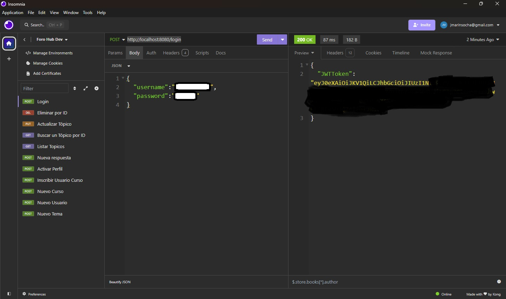
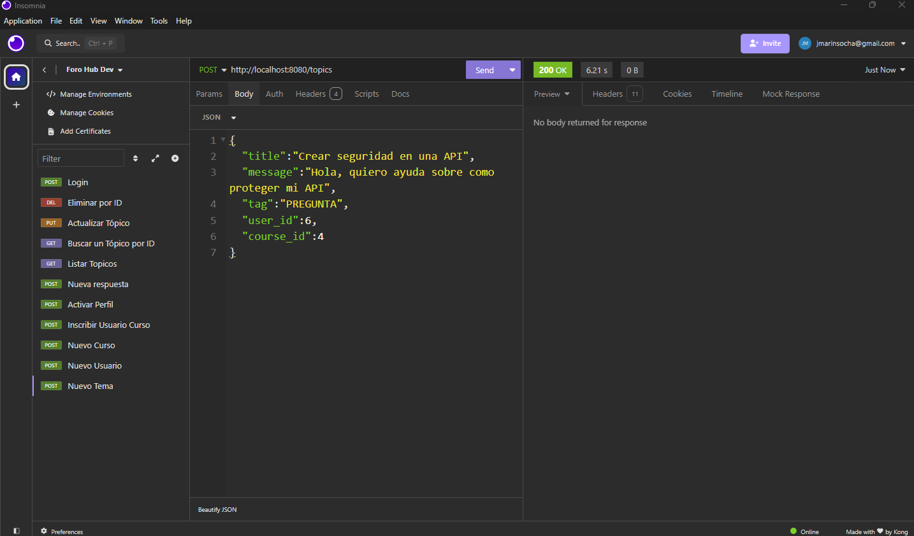

<h1 align="center">Challenge Foro Hub</h1>

<h3>Índice</h3>

<h2 id="descripción-del-proyecto">Descripción del proyecto</h2>

Este proyecto fue creado como propuesta de solución al challenge ForoHub del programa de formación ONE de Oracle y Alura Latam. El proyecto consiste en una aplicación java backend, que expone una API que permite logear usuarios, crear tópicos y asociar respuestas de otros usuarios. La persistencia de información se lleva a cabo en mysql.

<h2 id="caracteristicas">Características de la aplicación y demostración</h2>

- `Configuración inicial` : Se le solicita al usuario logearse desde el cliente seleccionado, como Insomnia o Postman, en donde se genera un token de acceso a los métodos. Debe seguir la ruta `POST: http://localhost:8080/login`
  

- `Rutas disponibles` :
  

- `[1] Nuevo tópico` : `POST: http://localhost:8080/topics`
- `[2] Listar tópicos` : `GET: http://localhost:8080/topics`
- `[3] Buscar tópico por ID` : `POST: http://localhost:8080/topics/{id}`
- `[4] Actualizar tópico por ID` : `PUT: http://localhost:8080/topics`
- `[5] Eliminar tópico por ID` : `DELETE: http://localhost:8080/topics/{id}`

<h2 id="tecnologías-utilizadas">Tecnologías utilizadas</h2>

La aplicación fue desarrollada usando JAVA, implementando clases, objetos, interfaces, API, Hibernate, JPA, JWT Security.
